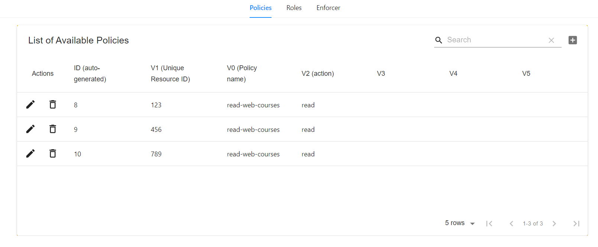
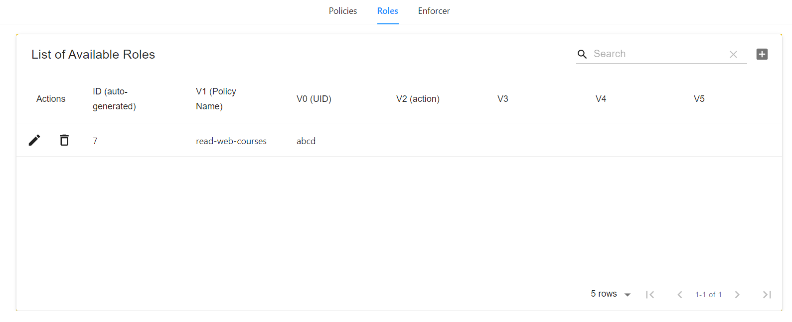
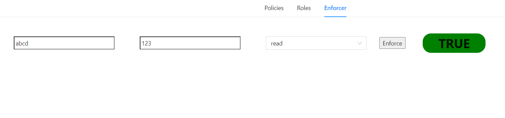

# Casbin-Role-Mgt-Dashboard-RBAC

### Authorization Role management UI 

This application will help you :

* `create` , `update` and `delete` Policies according to which roles are assigned 

*  `create` , `update` and `delete` User Roles for access of data

* Simulate `read`,`write`,`update` and `delete` operations and whether a particular `userid` is authorized to perform the selected operation

### Set-up 

1. https://github.com/alikhan866/Casbin-Role-Mgt-Dashboard-RBAC/blob/master/casbin-role-backend%20(NodeJS%20%2B%20Express)/README.md

2. https://github.com/alikhan866/Casbin-Role-Mgt-Dashboard-RBAC/blob/master/casbin-role-mgt-ui%20(React)/README.md

### Sample-useage

Here these 3 rows means

* read-web-courses `policy` has `read` permissions for `unique resource id` 123

* read-web-courses `policy` has `read` permissions for `unique resource id` 456

* read-web-courses `policy` has `read` permissions for `unique resource id` 789

Here this row means

* `user id` abcd has access to policy of `read-web-courses`

In the enforcer,

* we are checking if a user with `uid` abcd  has access to a resorce with unique resource id 123

* since we assigned `read` permission for `unique resource id` 123 to the policy `read-web-courses` and then assigned that policy to the `user id` 123 , The enforcement result therefore returns `true` 

